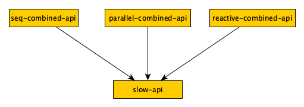
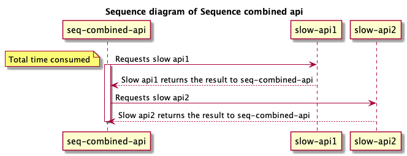
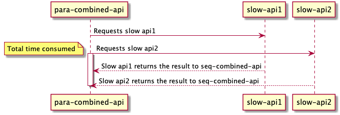
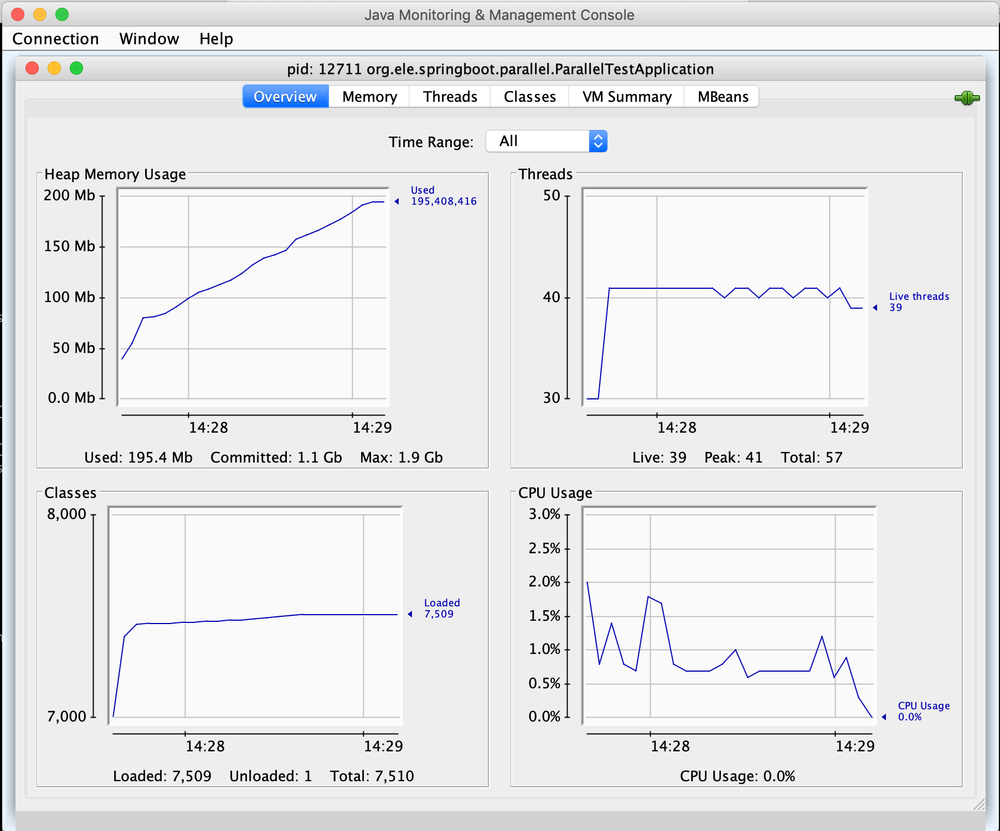
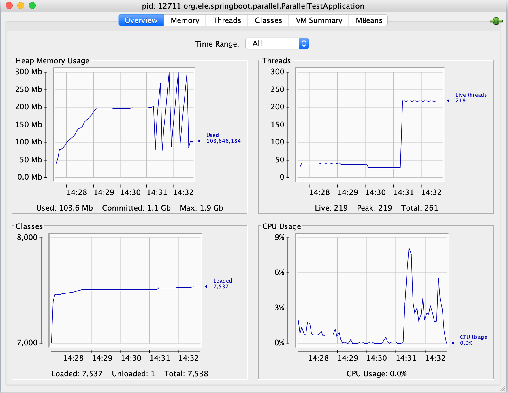
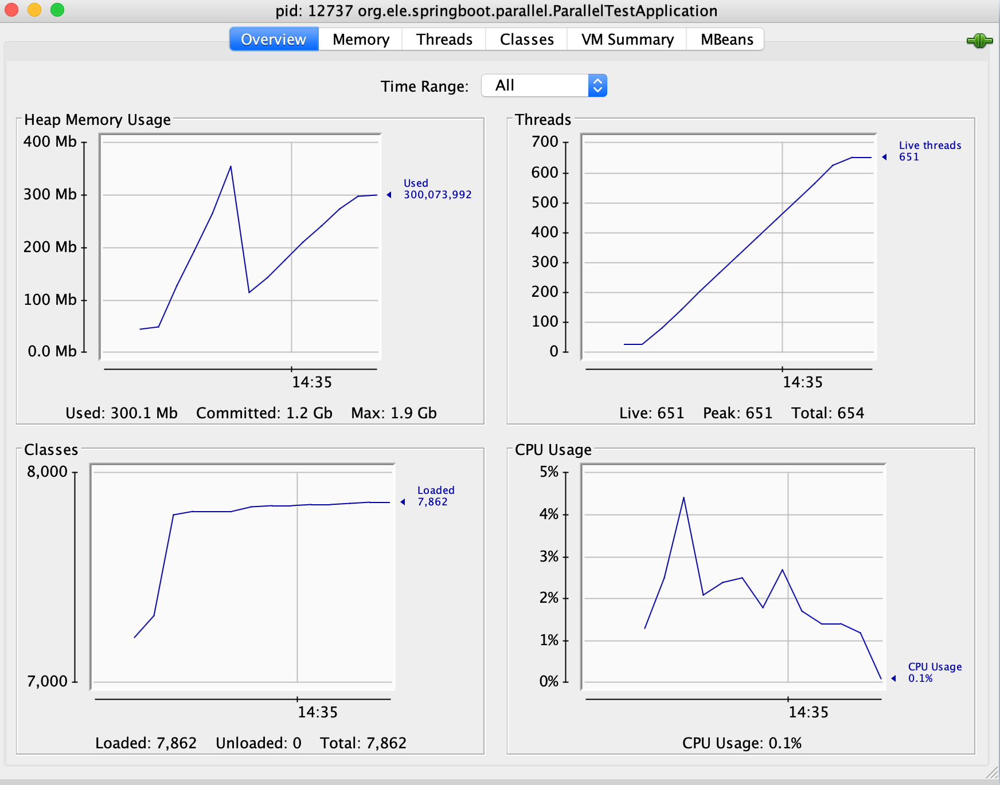
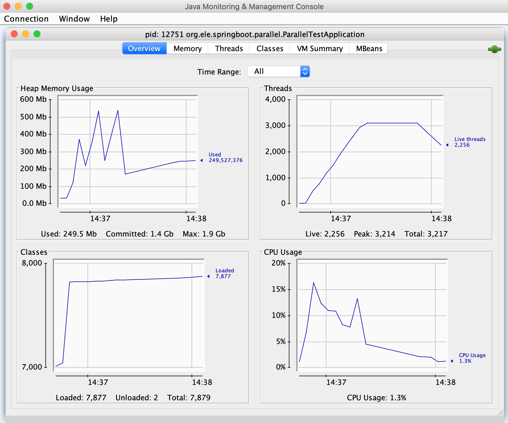
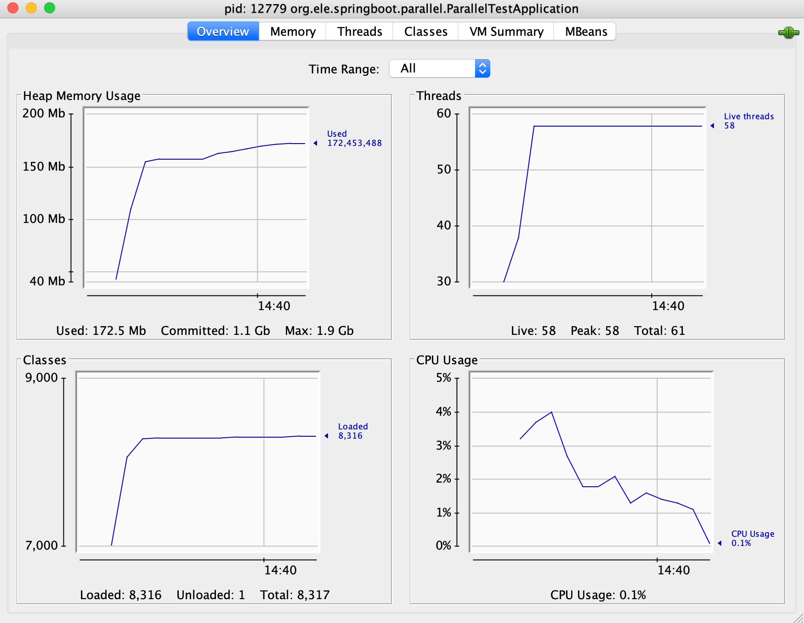
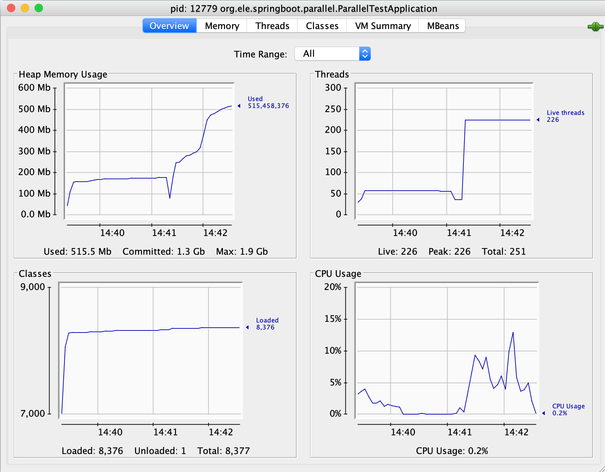

# Introduction
This project, based on Java 8 and Spring boot, is to learn and demonstrate the difference between sequential and parallel service call, and how the system performance is influenced by them.

# The structure of the apis



* A slow API, which sleeps for 2 seconds, is located in `/legacy/slow/{id}`. `{id}` can be any Integer number to represent different APIs.
* Other three APIs `/seq/combined`, `/parallel/combined`, `/webflux/combined` are represented for a combined API, which combines the backend APIs in a different way.
  * For simplify the example, they all call the slow API twice with different paramerters 1 and 2;
  * `/seq/combined` calls the slow APIs by sequence way;
  * `/parallel/combined` calls the slow APIs by parallel way(Asychronous by using [okhttp](https://github.com/square/okhttp/));
  * `/webflux/combined` calls the slow APIs by reactive way(Stream by using [spring-webflux](https://docs.spring.io/spring/docs/current/spring-framework-reference/web-reactive.html));





Obviously, the total time cost is the longest time of one of the backend APIs in parallel and reactive architecture, rather than the sum time for every APIs in sequential system.

```$shell
ELE-MacBook-Pro:parallel ele$ time curl -Is localhost:8080/seq/combined > /dev/null

real	0m4.033s
user	0m0.006s
sys	0m0.006s
ELE-MacBook-Pro:parallel ele$ time curl -Is localhost:8080/parallel/combined > /dev/null

real	0m2.060s
user	0m0.006s
sys	0m0.006s
ELE-MacBook-Pro:parallel ele$ time curl -Is localhost:8080/webflux/combined > /dev/null

real	0m2.051s
user	0m0.006s
sys	0m0.006s
```

# The performance

I did a benchmark on my laptop, and the data was collected below.

* The computer, CPU: `2.7 GHz Intel Core i7`, Memory: `16 GB 1600 MHz DDR3`
* Jvm parameters, `-Xms1G -Xmx2G`
* Use [Apache Benchmark](https://httpd.apache.org/docs/2.4/programs/ab.html) to request the apis with two specs. `-c 10 -n 200` is currency 10 and total number 200 requests, and `-c 100 -n 2000` is currency 100 and total number 2000 requests

Here are some overview indicators, and details are listed below the table.

| &nbsp;        | &nbsp;        | Sequcence           | Parallel  | Reactive  |
| ------------- | ------------- |:-------------:| -----:| -----:|
| -c 10 -n 200  | Time taken     | 84.617 | 43.387 | 43.726 |
| &nbsp;  | Maximum Thread number    | 41 | 651 | 58 |
| &nbsp;  | Peak Heap Memeory     | 200Mb | 349mb | 160Mb |
| -c 100 -n 2000  | Time taken     | 84.718 | - | 71.388 |
| &nbsp;  | Maximum Thread number    | 219 | 3100 | 226 |
| &nbsp;  | Peak Heap Memeory     | 300Mb | 550Mb | 510Mb |

### The performance of Sequence api 
With `-c 10 -n 200`, time taken for tests:   `84.617 seconds`


With `-c 100 -n 2000`, time taken for tests:   `84.718 seconds`

### The performance of parallel api
With `-c 10 -n 200`, time taken for tests:   `43.387 seconds`


With `-c 100 -n 2000`, the `ab` crashed until finished `898` requests completed


### The performance of reactive api
With `-c 10 -n 200`, time taken for tests:   `43.726 seconds`

With `-c 100 -n 2000`, time taken for tests:   `71.388 seconds`


# Further work
* Why does the total of the thread increased so much in Parallel call? Is it the problem of the implementation([okhttp](https://github.com/square/okhttp/)) or the architecture?
* Is it possible to decrease the programming complexity in parallel and reactive class?